# TrafficGuard AI — System Architecture

## Overview

TrafficGuard AI is an uncertainty-aware traffic violation detection platform designed for smart city deployments. The system combines real-time computer vision with explainable AI and human-in-the-loop review workflows.

## High-Level Architecture

```mermaid
graph TB
    subgraph Input Layer
        RTSP[RTSP Cameras]
        IP[IP Cameras]
        USB[USB Cameras]
        UPLOAD[File Upload]
        MOBILE[Mobile Enforcement]
    end

    subgraph Processing Layer
        API[FastAPI Backend]
        CELERY[Celery Workers]
        ML[ML Pipeline]
    end

    subgraph AI Pipeline
        Q1[Quality Assessment]
        Q2[CLAHE Enhancement]
        Q3[YOLOv8s Detection]
        Q4[PaddleOCR]
        Q5[MC Dropout Uncertainty]
        Q6[Explainability Engine]
        Q7[Routing Engine]
    end

    subgraph Storage Layer
        PG[(PostgreSQL)]
        MINIO[(MinIO)]
        ES[(Elasticsearch)]
        REDIS[(Redis)]
    end

    subgraph Output Layer
        AUTO[Auto Process ≥85%]
        REVIEW[Human Review 60-84%]
        DISCARD[Discard <60%]
    end

    subgraph Frontend
        DASH[Command Center]
        MONITOR[Live Monitoring]
        REVIEW_UI[Review Workflow]
        ANALYTICS[Smart City Analytics]
        TWIN[Digital Twin]
    end

    RTSP --> API
    IP --> API
    USB --> API
    UPLOAD --> API
    MOBILE --> API

    API --> CELERY
    CELERY --> ML
    ML --> Q1 --> Q2 --> Q3 --> Q4 --> Q5 --> Q6 --> Q7

    Q7 --> AUTO
    Q7 --> REVIEW
    Q7 --> DISCARD

    API --> PG
    API --> MINIO
    API --> ES
    CELERY --> REDIS

    API --> DASH
    API --> MONITOR
    API --> REVIEW_UI
    API --> ANALYTICS
    API --> TWIN
```



## Component Details

### Backend (FastAPI)
- Async SQLAlchemy with PostgreSQL
- JWT authentication with RBAC (Admin, Supervisor, Officer, Analyst)
- Rate limiting via SlowAPI
- Audit logging for all enforcement actions
- WebSocket support for live feeds

### ML Pipeline
| Stage | Module | Output |
|-------|--------|--------|
| 1 | `quality.py` | blur, brightness, noise, contrast scores |
| 2 | `enhancement.py` | CLAHE-enhanced image |
| 3 | `detection.py` | YOLOv8s bounding boxes + classes |
| 4 | `ocr.py` | plate text + alternatives |
| 5 | `uncertainty.py` | MC Dropout variance + stability |
| 6 | `explainability.py` | natural-language reasons |
| 7 | `routing.py` | auto/review/discard decision |

### Violation Modules
- `helmet_violation.py` — no-helmet detection on riders
- `seatbelt_violation.py` — seatbelt compliance
- `triple_riding.py` — multiple riders on motorcycle
- `red_light.py` — signal violation
- `wrong_side.py` — wrong-side driving
- `stop_line.py` — stop line crossing
- `parking_violation.py` — no-parking zone dwell

### Security
- SHA256 evidence hashing with integrity verification
- Chain of custody tracking
- Tamper detection on stored evidence
- Input validation on all API endpoints
- Role-based access control

## Deployment Topology

```
                    ┌─────────┐
                    │  NGINX  │
                    └────┬────┘
              ┌──────────┼──────────┐
              ▼                     ▼
        ┌──────────┐         ┌──────────┐
        │ Frontend │         │ Backend  │ ×2
        │  (Vite)  │         │ (FastAPI)│
        └──────────┘         └────┬─────┘
                                  │
              ┌───────────┬───────┼───────┬───────────┐
              ▼           ▼       ▼       ▼           ▼
         PostgreSQL    Redis   MinIO   ElasticSearch  Celery
```

## Scalability

- Horizontal pod autoscaling (2-10 backend replicas)
- Celery worker pool for async ML processing
- Redis-backed task queue with priority routing
- MinIO distributed object storage
- Elasticsearch for full-text search and analytics
